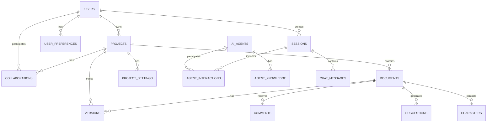
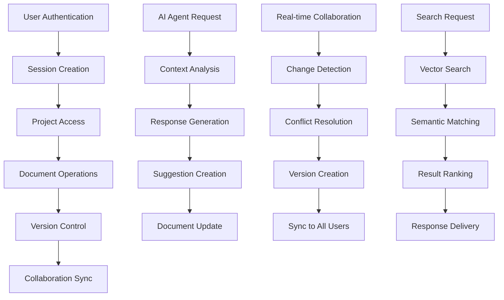

# Data Model & Database Schema Design
## The Writers Room - AWS Native Creative Writing IDE

---

## Executive Summary

This document defines the data model and database schema for The Writers Room platform, including entity relationships, data types, constraints, and lifecycle management. The design supports multi-tenant architecture, real-time collaboration, AI agent interactions, and enterprise-grade security requirements.

---

## 1. Database Architecture Overview

### 1.1 Multi-Database Strategy

- **Aurora PostgreSQL**: User management, project/document metadata, collaboration, AI agent interactions, audit trails.
- **OpenSearch**: Document embeddings for semantic search, AI agent knowledge bases, content similarity, RAG data.
- **ElastiCache Redis**: Session management, real-time collaboration, AI response caching, performance optimization.
- **S3**: Document content storage, user assets/media, backup/archival, export files.

### 1.2 Database Scaling Strategy

- **Aurora Serverless v2**: Auto-scaling, multi-AZ, read replicas, connection pooling.
- **OpenSearch**: Multi-node, auto-scaling, cross-zone, backup/snapshot management.
- **ElastiCache**: Redis cluster, multi-AZ, auto-failover, data persistence/backup.

---

## 2. Entity Relationship Diagram (ERD)

### 2.1 Core Entities



### 2.2 Core Entity Descriptions

- **USERS**: Registered users, authentication, preferences, and roles.
- **PROJECTS**: Writing projects, metadata, owner, and collaborators.
- **DOCUMENTS**: Screenplays, outlines, notes, and other creative documents.
- **VERSIONS**: Version history for documents.
- **COLLABORATIONS**: User roles and permissions on projects.
- **AI_AGENTS**: System and custom AI agents.
- **SESSIONS**: User and agent chat or editing sessions.
- **CHAT_MESSAGES**: Messages exchanged in sessions.
- **AGENT_INTERACTIONS**: AI agent requests and responses.
- **SUGGESTIONS**: AI or user-generated suggestions for documents.
- **CHARACTERS**: Character profiles within documents.
- **COMMENTS**: User comments and feedback on documents.
- **USER_PREFERENCES**: User-specific settings.
- **PROJECT_SETTINGS**: Project-specific configuration.

### 2.3 Data Flow Relationships



This flowchart illustrates the main data flows for authentication, project/document access, version control, AI agent interactions, real-time collaboration, and semantic search within The Writers Room platform.

---

## 3. Database Schema Specifications

### 3.1 Core Tables Overview

- **users**: Stores user accounts, authentication, and profile data.
- **projects**: Writing projects, metadata, and ownership.
- **documents**: Creative documents (screenplays, outlines, etc.) linked to projects.
- **versions**: Version history for documents.
- **collaborations**: User roles and permissions for projects.
- **ai_agents**: AI agent definitions and capabilities.
- **sessions**: User and agent chat/editing sessions.
- **chat_messages**: Messages exchanged in sessions.
- **agent_interactions**: AI agent requests and responses.
- **suggestions**: AI/user-generated suggestions for documents.
- **characters**: Character profiles within documents.
- **comments**: User comments and feedback on documents.
- **user_preferences**: User-specific settings.
- **project_settings**: Project-specific configuration.

#### Users Table
```sql
CREATE TABLE users (
    id UUID PRIMARY KEY DEFAULT gen_random_uuid(),
    email VARCHAR(255) UNIQUE NOT NULL,
    first_name VARCHAR(100) NOT NULL,
    last_name VARCHAR(100) NOT NULL,
    avatar_url TEXT,
    password_hash VARCHAR(255) NOT NULL,
    salt VARCHAR(255) NOT NULL,
    created_at TIMESTAMP WITH TIME ZONE DEFAULT NOW(),
    updated_at TIMESTAMP WITH TIME ZONE DEFAULT NOW(),
    is_active BOOLEAN DEFAULT TRUE,
    subscription_tier VARCHAR(50) DEFAULT 'free',
    last_login TIMESTAMP WITH TIME ZONE,
    email_verified BOOLEAN DEFAULT FALSE,
    mfa_enabled BOOLEAN DEFAULT FALSE,
    mfa_secret VARCHAR(255),
    failed_login_attempts INTEGER DEFAULT 0,
    locked_until TIMESTAMP WITH TIME ZONE,
    CONSTRAINT users_email_format CHECK (email ~* '^[A-Za-z0-9._%+-]+@[A-Za-z0-9.-]+\.[A-Z|a-z]{2,}$'),
    CONSTRAINT users_subscription_tier CHECK (subscription_tier IN ('free', 'pro', 'enterprise'))
);

-- Indexes
CREATE INDEX idx_users_email ON users(email);
CREATE INDEX idx_users_subscription_tier ON users(subscription_tier);
CREATE INDEX idx_users_created_at ON users(created_at);
CREATE INDEX idx_users_last_login ON users(last_login);
```

#### Projects Table
```sql
CREATE TABLE projects (
    id UUID PRIMARY KEY DEFAULT gen_random_uuid(),
    owner_id UUID NOT NULL REFERENCES users(id) ON DELETE CASCADE,
    title VARCHAR(255) NOT NULL,
    description TEXT,
    genre VARCHAR(100),
    status VARCHAR(50) DEFAULT 'active',
    created_at TIMESTAMP WITH TIME ZONE DEFAULT NOW(),
    updated_at TIMESTAMP WITH TIME ZONE DEFAULT NOW(),
    metadata JSONB DEFAULT '{}',
    is_archived BOOLEAN DEFAULT FALSE,
    visibility VARCHAR(20) DEFAULT 'private',
    template_id UUID,
    word_count INTEGER DEFAULT 0,
    character_count INTEGER DEFAULT 0,
    CONSTRAINT projects_status_check CHECK (status IN ('active', 'archived', 'deleted')),
    CONSTRAINT projects_visibility_check CHECK (visibility IN ('private', 'shared', 'public'))
);

-- Indexes
CREATE INDEX idx_projects_owner_id ON projects(owner_id);
CREATE INDEX idx_projects_status ON projects(status);
CREATE INDEX idx_projects_created_at ON projects(created_at);
CREATE INDEX idx_projects_genre ON projects(genre);
CREATE INDEX idx_projects_metadata ON projects USING GIN(metadata);
```

#### Documents Table
```sql
CREATE TABLE documents (
    id UUID PRIMARY KEY DEFAULT gen_random_uuid(),
    project_id UUID NOT NULL REFERENCES projects(id) ON DELETE CASCADE,
    title VARCHAR(255) NOT NULL,
    type VARCHAR(50) NOT NULL,
    content_hash VARCHAR(64) NOT NULL,
    s3_key VARCHAR(500) NOT NULL,
    version_number INTEGER DEFAULT 1,
    created_at TIMESTAMP WITH TIME ZONE DEFAULT NOW(),
    updated_at TIMESTAMP WITH TIME ZONE DEFAULT NOW(),
    metadata JSONB DEFAULT '{}',
    is_active BOOLEAN DEFAULT TRUE,
    word_count INTEGER DEFAULT 0,
    character_count INTEGER DEFAULT 0,
    last_edited_by UUID REFERENCES users(id),
    last_edited_at TIMESTAMP WITH TIME ZONE,
    CONSTRAINT documents_type_check CHECK (type IN ('screenplay', 'outline', 'character', 'notes', 'beat_sheet')),
    CONSTRAINT documents_version_number_positive CHECK (version_number > 0)
);

-- Indexes
CREATE INDEX idx_documents_project_id ON documents(project_id);
CREATE INDEX idx_documents_type ON documents(type);
CREATE INDEX idx_documents_content_hash ON documents(content_hash);
CREATE INDEX idx_documents_updated_at ON documents(updated_at);
CREATE INDEX idx_documents_metadata ON documents USING GIN(metadata);
CREATE UNIQUE INDEX idx_documents_project_version ON documents(project_id, version_number);
```

#### Versions Table
```sql
CREATE TABLE versions (
    id UUID PRIMARY KEY DEFAULT gen_random_uuid(),
    document_id UUID NOT NULL REFERENCES documents(id) ON DELETE CASCADE,
    version_number INTEGER NOT NULL,
    content_hash VARCHAR(64) NOT NULL,
    s3_key VARCHAR(500) NOT NULL,
    created_by UUID NOT NULL REFERENCES users(id),
    created_at TIMESTAMP WITH TIME ZONE DEFAULT NOW(),
    change_summary TEXT,
    diff_data JSONB DEFAULT '{}',
    word_count INTEGER DEFAULT 0,
    character_count INTEGER DEFAULT 0,
    CONSTRAINT versions_version_number_positive CHECK (version_number > 0)
);

-- Indexes
CREATE INDEX idx_versions_document_id ON versions(document_id);
CREATE INDEX idx_versions_created_by ON versions(created_by);
CREATE INDEX idx_versions_created_at ON versions(created_at);
CREATE UNIQUE INDEX idx_versions_document_version ON versions(document_id, version_number);
```

#### Collaborations Table
```sql
CREATE TABLE collaborations (
    id UUID PRIMARY KEY DEFAULT gen_random_uuid(),
    project_id UUID NOT NULL REFERENCES projects(id) ON DELETE CASCADE,
    user_id UUID NOT NULL REFERENCES users(id) ON DELETE CASCADE,
    role VARCHAR(50) NOT NULL,
    permissions JSONB DEFAULT '{}',
    joined_at TIMESTAMP WITH TIME ZONE DEFAULT NOW(),
    updated_at TIMESTAMP WITH TIME ZONE DEFAULT NOW(),
    is_active BOOLEAN DEFAULT TRUE,
    invited_by UUID REFERENCES users(id),
    invitation_token VARCHAR(255),
    invitation_expires_at TIMESTAMP WITH TIME ZONE,
    CONSTRAINT collaborations_role_check CHECK (role IN ('owner', 'editor', 'commenter', 'viewer')),
    CONSTRAINT collaborations_unique_user_project UNIQUE(project_id, user_id)
);

-- Indexes
CREATE INDEX idx_collaborations_project_id ON collaborations(project_id);
CREATE INDEX idx_collaborations_user_id ON collaborations(user_id);
CREATE INDEX idx_collaborations_role ON collaborations(role);
CREATE INDEX idx_collaborations_permissions ON collaborations USING GIN(permissions);
```

#### User Preferences Table
```sql
CREATE TABLE user_preferences (
    id UUID PRIMARY KEY DEFAULT gen_random_uuid(),
    user_id UUID NOT NULL REFERENCES users(id) ON DELETE CASCADE,
    preference_key VARCHAR(100) NOT NULL,
    preference_value JSONB DEFAULT '{}',
    created_at TIMESTAMP WITH TIME ZONE DEFAULT NOW(),
    updated_at TIMESTAMP WITH TIME ZONE DEFAULT NOW()
);

-- Indexes
CREATE INDEX idx_user_preferences_user_id ON user_preferences(user_id);
CREATE INDEX idx_user_preferences_key ON user_preferences(preference_key);
```

#### Project Settings Table
```sql
CREATE TABLE project_settings (
    id UUID PRIMARY KEY DEFAULT gen_random_uuid(),
    project_id UUID NOT NULL REFERENCES projects(id) ON DELETE CASCADE,
    setting_key VARCHAR(100) NOT NULL,
    setting_value JSONB DEFAULT '{}',
    created_at TIMESTAMP WITH TIME ZONE DEFAULT NOW(),
    updated_at TIMESTAMP WITH TIME ZONE DEFAULT NOW()
);

-- Indexes
CREATE INDEX idx_project_settings_project_id ON project_settings(project_id);
CREATE INDEX idx_project_settings_key ON project_settings(setting_key);
```

### 3.2 AI and Chat Tables

#### AI Agents Table
```sql
CREATE TABLE ai_agents (
    id UUID PRIMARY KEY DEFAULT gen_random_uuid(),
    name VARCHAR(100) NOT NULL,
    personality TEXT NOT NULL,
    specialty VARCHAR(100) NOT NULL,
    capabilities JSONB DEFAULT '{}',
    is_available BOOLEAN DEFAULT TRUE,
    response_time_ms INTEGER DEFAULT 2000,
    created_at TIMESTAMP WITH TIME ZONE DEFAULT NOW(),
    updated_at TIMESTAMP WITH TIME ZONE DEFAULT NOW(),
    model_id VARCHAR(100),
    cost_per_request DECIMAL(10,6) DEFAULT 0.001,
    max_tokens INTEGER DEFAULT 4000,
    temperature DECIMAL(3,2) DEFAULT 0.7,
    CONSTRAINT ai_agents_response_time_positive CHECK (response_time_ms > 0),
    CONSTRAINT ai_agents_cost_positive CHECK (cost_per_request >= 0)
);

-- Indexes
CREATE INDEX idx_ai_agents_specialty ON ai_agents(specialty);
CREATE INDEX idx_ai_agents_available ON ai_agents(is_available);
CREATE INDEX idx_ai_agents_capabilities ON ai_agents USING GIN(capabilities);
```

#### Sessions Table
```sql
CREATE TABLE sessions (
    id UUID PRIMARY KEY DEFAULT gen_random_uuid(),
    user_id UUID NOT NULL REFERENCES users(id) ON DELETE CASCADE,
    project_id UUID REFERENCES projects(id) ON DELETE SET NULL,
    session_type VARCHAR(50) NOT NULL,
    started_at TIMESTAMP WITH TIME ZONE DEFAULT NOW(),
    ended_at TIMESTAMP WITH TIME ZONE,
    context_data JSONB DEFAULT '{}',
    is_active BOOLEAN DEFAULT TRUE,
    agent_id UUID REFERENCES ai_agents(id),
    document_id UUID REFERENCES documents(id),
    CONSTRAINT sessions_type_check CHECK (session_type IN ('writing', 'chat', 'collaboration', 'review'))
);

-- Indexes
CREATE INDEX idx_sessions_user_id ON sessions(user_id);
CREATE INDEX idx_sessions_project_id ON sessions(project_id);
CREATE INDEX idx_sessions_active ON sessions(is_active);
CREATE INDEX idx_sessions_started_at ON sessions(started_at);
```

#### Chat Messages Table
```sql
CREATE TABLE chat_messages (
    id UUID PRIMARY KEY DEFAULT gen_random_uuid(),
    session_id UUID NOT NULL REFERENCES sessions(id) ON DELETE CASCADE,
    sender_id UUID REFERENCES users(id) ON DELETE SET NULL,
    agent_id UUID REFERENCES ai_agents(id) ON DELETE SET NULL,
    message_type VARCHAR(50) NOT NULL,
    content TEXT NOT NULL,
    metadata JSONB DEFAULT '{}',
    created_at TIMESTAMP WITH TIME ZONE DEFAULT NOW(),
    is_edited BOOLEAN DEFAULT FALSE,
    edited_at TIMESTAMP WITH TIME ZONE,
    parent_message_id UUID REFERENCES chat_messages(id),
    confidence_score DECIMAL(3,2),
    processing_time_ms INTEGER,
    CONSTRAINT chat_messages_type_check CHECK (message_type IN ('user', 'agent', 'system', 'suggestion')),
    CONSTRAINT chat_messages_confidence_range CHECK (confidence_score >= 0 AND confidence_score <= 1)
);

-- Indexes
CREATE INDEX idx_chat_messages_session_id ON chat_messages(session_id);
CREATE INDEX idx_chat_messages_sender_id ON chat_messages(sender_id);
CREATE INDEX idx_chat_messages_agent_id ON chat_messages(agent_id);
CREATE INDEX idx_chat_messages_created_at ON chat_messages(created_at);
CREATE INDEX idx_chat_messages_parent ON chat_messages(parent_message_id);
```

#### Agent Interactions Table
```sql
CREATE TABLE agent_interactions (
    id UUID PRIMARY KEY DEFAULT gen_random_uuid(),
    session_id UUID NOT NULL REFERENCES sessions(id) ON DELETE CASCADE,
    agent_id UUID NOT NULL REFERENCES ai_agents(id),
    user_id UUID NOT NULL REFERENCES users(id) ON DELETE CASCADE,
    interaction_type VARCHAR(50) NOT NULL,
    prompt TEXT NOT NULL,
    response TEXT NOT NULL,
    suggestions JSONB DEFAULT '[]',
    confidence_score DECIMAL(3,2),
    processing_time_ms INTEGER,
    tokens_used INTEGER,
    cost DECIMAL(10,6),
    model_used VARCHAR(100),
    created_at TIMESTAMP WITH TIME ZONE DEFAULT NOW(),
    CONSTRAINT agent_interactions_type_check CHECK (interaction_type IN ('dialogue', 'character', 'structure', 'market', 'general')),
    CONSTRAINT agent_interactions_confidence_range CHECK (confidence_score >= 0 AND confidence_score <= 1)
);

-- Indexes
CREATE INDEX idx_agent_interactions_session_id ON agent_interactions(session_id);
CREATE INDEX idx_agent_interactions_agent_id ON agent_interactions(agent_id);
CREATE INDEX idx_agent_interactions_user_id ON agent_interactions(user_id);
CREATE INDEX idx_agent_interactions_created_at ON agent_interactions(created_at);
CREATE INDEX idx_agent_interactions_type ON agent_interactions(interaction_type);
```

#### Suggestions Table
```sql
CREATE TABLE suggestions (
    id UUID PRIMARY KEY DEFAULT gen_random_uuid(),
    document_id UUID NOT NULL REFERENCES documents(id) ON DELETE CASCADE,
    agent_id UUID REFERENCES ai_agents(id) ON DELETE SET NULL,
    suggestion_type VARCHAR(50) NOT NULL,
    content TEXT NOT NULL,
    metadata JSONB DEFAULT '{}',
    confidence_score DECIMAL(3,2),
    status VARCHAR(20) DEFAULT 'pending',
    created_at TIMESTAMP WITH TIME ZONE DEFAULT NOW(),
    applied_at TIMESTAMP WITH TIME ZONE,
    applied_by UUID REFERENCES users(id),
    alternatives JSONB DEFAULT '[]',
    CONSTRAINT suggestions_type_check CHECK (suggestion_type IN ('dialogue', 'character', 'structure', 'style', 'market')),
    CONSTRAINT suggestions_status_check CHECK (status IN ('pending', 'applied', 'rejected', 'modified')),
    CONSTRAINT suggestions_confidence_range CHECK (confidence_score >= 0 AND confidence_score <= 1)
);

-- Indexes
CREATE INDEX idx_suggestions_document_id ON suggestions(document_id);
CREATE INDEX idx_suggestions_agent_id ON suggestions(agent_id);
CREATE INDEX idx_suggestions_status ON suggestions(status);
CREATE INDEX idx_suggestions_created_at ON suggestions(created_at);
```

### 3.3 Supporting Tables

#### Characters Table
```sql
CREATE TABLE characters (
    id UUID PRIMARY KEY DEFAULT gen_random_uuid(),
    document_id UUID NOT NULL REFERENCES documents(id) ON DELETE CASCADE,
    name VARCHAR(100) NOT NULL,
    role VARCHAR(100),
    description TEXT,
    attributes JSONB DEFAULT '{}',
    relationships JSONB DEFAULT '{}',
    created_at TIMESTAMP WITH TIME ZONE DEFAULT NOW(),
    updated_at TIMESTAMP WITH TIME ZONE DEFAULT NOW(),
    created_by UUID REFERENCES users(id),
    CONSTRAINT characters_name_not_empty CHECK (name != '')
);

-- Indexes
CREATE INDEX idx_characters_document_id ON characters(document_id);
CREATE INDEX idx_characters_name ON characters(name);
CREATE INDEX idx_characters_attributes ON characters USING GIN(attributes);
CREATE INDEX idx_characters_relationships ON characters USING GIN(relationships);
```

#### Comments Table
```sql
CREATE TABLE comments (
    id UUID PRIMARY KEY DEFAULT gen_random_uuid(),
    document_id UUID NOT NULL REFERENCES documents(id) ON DELETE CASCADE,
    user_id UUID NOT NULL REFERENCES users(id) ON DELETE CASCADE,
    content TEXT NOT NULL,
    position_data JSONB DEFAULT '{}',
    created_at TIMESTAMP WITH TIME ZONE DEFAULT NOW(),
    updated_at TIMESTAMP WITH TIME ZONE DEFAULT NOW(),
    is_resolved BOOLEAN DEFAULT FALSE
);

-- Indexes
CREATE INDEX idx_comments_document_id ON comments(document_id);
CREATE INDEX idx_comments_user_id ON comments(user_id);
CREATE INDEX idx_comments_created_at ON comments(created_at);
```

---

## 4. Data Lifecycle Management

### 4.1 Data Retention Policies
- **User Data**: Active indefinitely; deleted data retained 30 days (soft delete); audit logs 7 years.
- **Project Data**: Active indefinitely; archived 5 years; deleted 90 days (soft delete); versions 10 years.
- **Chat/AI Data**: Chat messages 2 years; AI interactions 1 year; suggestions 6 months; session data 30 days.
- **System Data**: Logs 90 days; metrics 1 year; backups 7 years; cache 24 hours.

### 4.2 Backup and Recovery
- Automated daily backups for all databases (Aurora, OpenSearch, Redis, S3).
- Retain backups for 30 days (operational), 7 years (compliance).
- Point-in-time recovery enabled for Aurora and S3.

### 4.3 Data Archival Strategy
- Archive old chat messages and AI interactions to cold storage after retention period.
- Use S3 Glacier for long-term archival.
- Scheduled archival jobs run monthly.

---

## 5. Data Security and Privacy

### 5.1 Encryption Strategy
- All data in transit encrypted with TLS 1.2+.
- Aurora: Transparent Data Encryption (TDE) at rest; column-level encryption for sensitive fields (e.g., PII).
- S3: Server-side encryption (SSE-S3 or SSE-KMS).
- OpenSearch/Redis: Encryption at rest and in transit.

### 5.2 Data Masking and Anonymization
- Mask PII in lower environments (dev/test) using data masking functions.
- Anonymize user data for analytics and AI training.

### 5.3 Access Control
- Row-level security (RLS) on Aurora for projects, documents, and collaborations.
- Fine-grained IAM roles for AWS resources.
- Principle of least privilege for all service accounts and users.

---

## 6. Performance Optimization

### 6.1 Indexing Strategy
- Composite indexes for common queries (e.g., project+status, document+type).
- Partial indexes for active data (e.g., is_active=true).
- Full-text search indexes on document titles and project descriptions.

### 6.2 Partitioning Strategy
- Partition large tables (e.g., chat_messages, agent_interactions) by date for efficient archiving and query performance.

### 6.3 Query Optimization
- Use materialized views for complex analytics (e.g., project statistics).
- Optimize search with GIN indexes and vector search in OpenSearch.

---

## 7. Data Migration Strategy

### 7.1 Migration Planning
- **Phase 1: Schema Setup** – Create schema, indexes, constraints, security policies; test with sample data.
- **Phase 2: Data Migration** – Migrate user, project, and document data; validate integrity.
- **Phase 3: Application Migration** – Update app to use new schema; test all functionality; performance and rollback plan.
- **Phase 4: Production Cutover** – Final sync, deploy, monitor, cleanup.

### 7.2 Best Practices
- Use transactional migration scripts with versioning.
- Validate data integrity and consistency at each step.
- Maintain rollback scripts for all migrations.

---

## 8. Monitoring and Analytics

### 8.1 Database Monitoring
- Use AWS CloudWatch for Aurora, OpenSearch, Redis, and S3 metrics.
- Monitor query performance, slow queries, and table sizes with built-in and custom dashboards.
- Set up alerts for high latency, replication lag, and storage thresholds.

### 8.2 Data Quality Monitoring
- Regular data quality checks for orphaned records, duplicates, and version consistency.
- Automated scripts to report and remediate data quality issues.

---

## Conclusion

This data model and schema design provides a robust foundation for The Writers Room, supporting scalability, security, performance, reliability, and compliance. The schema is designed for real-time collaboration, AI agent integration, and enterprise-grade requirements, ensuring a future-proof platform for creative writing teams. 