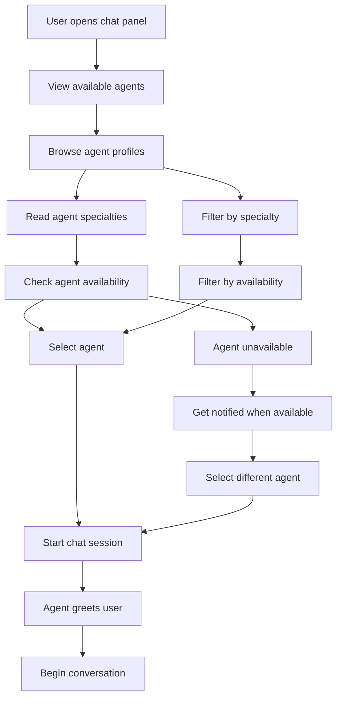
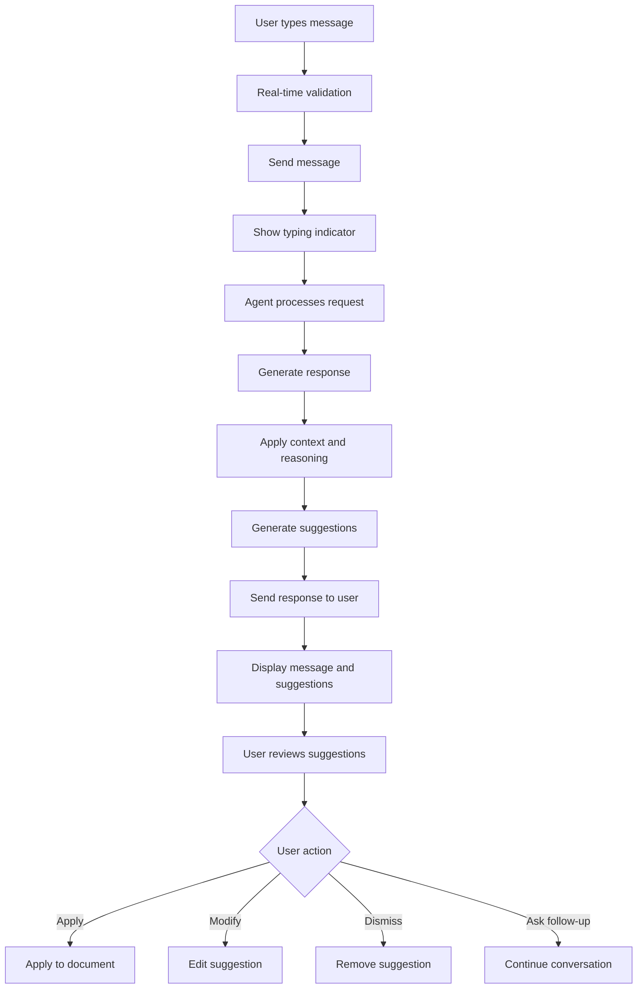

# Writers Room Agent Chat Specification
## Comprehensive AI Agent Interaction System

---

## Executive Summary

This document provides a detailed specification for The Writers Room agent chat system, defining the complete user experience, technical architecture, and implementation requirements for AI agent interactions. The system enables writers to collaborate with specialized AI agents modeled after famous screenwriters and creative professionals.

---

## 1. System Overview

### 1.1 Core Concept

The Writers Room agent chat system provides an intuitive, real-time interface for writers to interact with specialized AI agents that offer creative guidance, technical feedback, and collaborative writing assistance. Each agent has a distinct personality, expertise, and communication style modeled after renowned creative professionals.

### 1.2 Key Features

```yaml
Core Features:
  Multi-Agent System:
    - Specialized agents with unique personalities
    - Agent selection and switching
    - Multi-agent collaboration ("Ask the Room")
    - Agent availability and status indicators
  
  Real-time Interaction:
    - Instant agent responses
    - Typing indicators and status updates
    - Real-time suggestion application
    - Live collaboration features
  
  Context-Aware Assistance:
    - Document-aware suggestions
    - Character and plot continuity
    - Genre-specific guidance
    - Writing style consistency
  
  Creative Enhancement:
    - Dialogue improvement suggestions
    - Character development insights
    - Plot structure analysis
    - Market and industry insights
```

---

## 2. Agent Types & Personalities

### 2.1 Script Doctor Agent

```yaml
Script Doctor Agent:
  Personality: "Aaron Sorkin"
  Specialty: Dialogue and Structure
  Communication Style:
    - Direct and analytical
    - Focuses on dramatic structure
    - Provides specific, actionable feedback
    - Uses industry terminology
  
  Capabilities:
    - Dialogue enhancement and naturalization
    - Scene structure analysis
    - Character motivation insights
    - Pacing and rhythm optimization
    - Industry standard compliance
  
  Response Patterns:
    - Asks clarifying questions
    - Provides multiple options
    - Explains reasoning behind suggestions
    - References successful examples
```

### 2.2 Character Specialist Agent

```yaml
Character Specialist Agent:
  Personality: "Quentin Tarantino"
  Specialty: Character Development
  Communication Style:
    - Conversational and engaging
    - Focuses on character depth
    - Uses pop culture references
    - Encourages creative exploration
  
  Capabilities:
    - Character backstory development
    - Character voice consistency
    - Character arc analysis
    - Relationship dynamics
    - Character motivation exploration
  
  Response Patterns:
    - Explores character psychology
    - Suggests character development exercises
    - Analyzes character interactions
    - Provides character-specific dialogue suggestions
```

### 2.3 Creative Visionary Agent

```yaml
Creative Visionary Agent:
  Personality: "Christopher Nolan"
  Specialty: Concept and Innovation
  Communication Style:
    - Philosophical and conceptual
    - Focuses on big picture ideas
    - Encourages innovative thinking
    - Uses metaphors and analogies
  
  Capabilities:
    - Concept development and refinement
    - Innovative storytelling techniques
    - Genre-bending suggestions
    - Visual storytelling guidance
    - Theme exploration
  
  Response Patterns:
    - Explores thematic elements
    - Suggests structural innovations
    - Encourages creative risks
    - Provides conceptual frameworks
```

### 2.4 Market Analyst Agent

```yaml
Market Analyst Agent:
  Personality: "Industry Expert"
  Specialty: Market and Industry Insights
  Communication Style:
    - Data-driven and analytical
    - Focuses on market trends
    - Provides industry context
    - Uses statistics and examples
  
  Capabilities:
    - Market trend analysis
    - Genre popularity insights
    - Audience targeting guidance
    - Industry standard compliance
    - Success probability assessment
  
  Response Patterns:
    - Provides market data
    - Suggests audience considerations
    - Analyzes competitive landscape
    - Offers industry best practices
```

---

## 3. User Interface Design

### 3.1 Chat Interface Layout

```typescript
// Chat Interface Component Structure
interface AgentChatInterface {
  layout: {
    // Main chat area
    chatArea: {
      width: '70%',
      height: '100%',
      display: 'flex',
      flexDirection: 'column'
    },
    
    // Agent selection sidebar
    agentSidebar: {
      width: '30%',
      height: '100%',
      backgroundColor: '#F8FAFC',
      borderLeft: '1px solid #E2E8F0'
    }
  };
  
  components: {
    // Agent selection panel
    agentSelector: AgentSelector;
    
    // Chat messages area
    chatMessages: ChatMessages;
    
    // Message input area
    messageInput: MessageInput;
    
    // Agent suggestions panel
    suggestionsPanel: SuggestionsPanel;
    
    // Quick actions toolbar
    quickActions: QuickActions;
  };
}

// Agent Selector Component
interface AgentSelector {
  agents: AIAgent[];
  selectedAgent: AIAgent;
  onAgentSelect: (agent: AIAgent) => void;
  
  agentCard: {
    display: 'flex',
    alignItems: 'center',
    padding: '16px',
    margin: '8px',
    borderRadius: '12px',
    cursor: 'pointer',
    transition: 'all 0.2s ease',
    
    selected: {
      backgroundColor: '#2563EB',
      color: '#FFFFFF'
    },
    
    hover: {
      backgroundColor: '#F1F5F9',
      transform: 'translateY(-1px)'
    }
  };
}
```

### 3.2 Message Display System

```typescript
// Message Types and Display
interface ChatMessage {
  id: string;
  type: 'user' | 'agent' | 'system' | 'suggestion';
  sender: {
    id: string;
    name: string;
    avatar: string;
    role: 'user' | 'agent';
  };
  content: string;
  timestamp: Date;
  metadata: {
    agentId?: string;
    suggestions?: Suggestion[];
    confidence?: number;
    processingTime?: number;
  };
  actions: MessageAction[];
}

// Message Display Component
const MessageDisplay: React.FC<{ message: ChatMessage }> = ({ message }) => {
  return (
    <div className={`message message--${message.type}`}>
      {/* Message Header */}
      <div className="message-header">
        
        <div className="message-info">
          <span className="message-sender">{message.sender.name}</span>
          <span className="message-time">
            {formatTimestamp(message.timestamp)}
          </span>
        </div>
        {message.metadata.confidence && (
          <div className="message-confidence">
            {Math.round(message.metadata.confidence * 100)}% confidence
          </div>
        )}
      </div>
      
      {/* Message Content */}
      <div className="message-content">
        <div className="message-text">{message.content}</div>
        
        {/* Suggestions */}
        {message.metadata.suggestions && (
          <div className="message-suggestions">
            {message.metadata.suggestions.map(suggestion => (
              <SuggestionCard 
                key={suggestion.id}
                suggestion={suggestion}
                onApply={handleSuggestionApply}
                onModify={handleSuggestionModify}
              />
            ))}
          </div>
        )}
      </div>
      
      {/* Message Actions */}
      <div className="message-actions">
        {message.actions.map(action => (
          <button
            key={action.id}
            className={`action-button action-button--${action.type}`}
            onClick={() => handleAction(action)}
          >
            {action.icon}
            {action.label}
          </button>
        ))}
      </div>
    </div>
  );
};
```

### 3.3 Suggestion System

```typescript
// Suggestion Types and Display
interface Suggestion {
  id: string;
  type: 'dialogue' | 'character' | 'structure' | 'style' | 'market';
  content: string;
  confidence: number;
  reasoning: string;
  alternatives: string[];
  metadata: {
    startPosition?: number;
    endPosition?: number;
    characterId?: string;
    sceneId?: string;
  };
}

// Suggestion Card Component
const SuggestionCard: React.FC<{ 
  suggestion: Suggestion;
  onApply: (suggestion: Suggestion) => void;
  onModify: (suggestion: Suggestion) => void;
}> = ({ suggestion, onApply, onModify }) => {
  return (
    <div className="suggestion-card">
      <div className="suggestion-header">
        <span className="suggestion-type">{suggestion.type}</span>
        <span className="suggestion-confidence">
          {Math.round(suggestion.confidence * 100)}%
        </span>
      </div>
      
      <div className="suggestion-content">
        <p className="suggestion-text">{suggestion.content}</p>
        <p className="suggestion-reasoning">{suggestion.reasoning}</p>
      </div>
      
      {suggestion.alternatives.length > 0 && (
        <div className="suggestion-alternatives">
          <h4>Alternative Options:</h4>
          {suggestion.alternatives.map((alt, index) => (
            <button
              key={index}
              className="alternative-option"
              onClick={() => onModify({ ...suggestion, content: alt })}
            >
              {alt}
            </button>
          ))}
        </div>
      )}
      
      <div className="suggestion-actions">
        <button
          className="action-button action-button--apply"
          onClick={() => onApply(suggestion)}
        >
          Apply Suggestion
        </button>
        <button
          className="action-button action-button--modify"
          onClick={() => onModify(suggestion)}
        >
          Modify
        </button>
        <button
          className="action-button action-button--dismiss"
          onClick={() => handleDismiss(suggestion.id)}
        >
          Dismiss
        </button>
      </div>
    </div>
  );
};
```

---

## 4. Technical Architecture

### 4.1 Backend Architecture

```yaml
Backend Services:
  Agent Chat Service:
    - Real-time message processing
    - Agent selection and routing
    - Context management
    - Response generation
  
  AI Processing Service:
    - Bedrock model integration
    - Prompt engineering
    - Response optimization
    - Cost management
  
  Context Management Service:
    - Document context extraction
    - Character and plot tracking
    - Session management
    - Memory and history
  
  Collaboration Service:
    - Multi-user chat support
    - Real-time synchronization
    - Conflict resolution
    - Presence management
```

### 4.2 API Endpoints

```typescript
// Agent Chat API Endpoints
interface AgentChatAPI {
  // Agent Management
  'GET /api/v1/agents': {
    description: 'Get available agents',
    response: AIAgent[];
  };
  
  'GET /api/v1/agents/{agentId}': {
    description: 'Get agent details',
    response: AIAgent;
  };
  
  // Chat Management
  'POST /api/v1/chat/sessions': {
    description: 'Create new chat session',
    request: {
      agentId: string;
      documentId?: string;
      context?: ChatContext;
    };
    response: ChatSession;
  };
  
  'GET /api/v1/chat/sessions/{sessionId}/messages': {
    description: 'Get chat messages',
    query: {
      page?: number;
      limit?: number;
      before?: string;
    };
    response: ChatMessage[];
  };
  
  'POST /api/v1/chat/sessions/{sessionId}/messages': {
    description: 'Send message to agent',
    request: {
      content: string;
      context?: MessageContext;
    };
    response: ChatMessage;
  };
  
  // Suggestions
  'POST /api/v1/chat/sessions/{sessionId}/suggestions': {
    description: 'Get suggestions for document',
    request: {
      documentId: string;
      selection?: {
        start: number;
        end: number;
      };
      type?: SuggestionType[];
    };
    response: Suggestion[];
  };
  
  'POST /api/v1/chat/sessions/{sessionId}/suggestions/{suggestionId}/apply': {
    description: 'Apply suggestion to document',
    request: {
      documentId: string;
      modifications?: any;
    };
    response: DocumentUpdate;
  };
  
  // Multi-Agent Collaboration
  'POST /api/v1/chat/room': {
    description: 'Ask multiple agents',
    request: {
      message: string;
      agentIds: string[];
      documentId?: string;
    };
    response: AgentResponse[];
  };
}
```

### 4.3 WebSocket Events

```typescript
// WebSocket Event Types
interface WebSocketEvents {
  // Connection Events
  'chat:connect': {
    sessionId: string;
    userId: string;
    agentId?: string;
  };
  
  'chat:disconnect': {
    sessionId: string;
    userId: string;
  };
  
  // Message Events
  'chat:message': {
    sessionId: string;
    message: ChatMessage;
  };
  
  'chat:typing': {
    sessionId: string;
    agentId: string;
    isTyping: boolean;
  };
  
  'chat:suggestion': {
    sessionId: string;
    suggestion: Suggestion;
  };
  
  // Agent Events
  'agent:status': {
    agentId: string;
    status: 'available' | 'busy' | 'offline';
    responseTime?: number;
  };
  
  'agent:response': {
    sessionId: string;
    agentId: string;
    response: AgentResponse;
  };
  
  // Collaboration Events
  'collaboration:user_joined': {
    sessionId: string;
    user: User;
  };
  
  'collaboration:user_left': {
    sessionId: string;
    userId: string;
  };
  
  'collaboration:presence_update': {
    sessionId: string;
    users: UserPresence[];
  };
}
```

---

## 5. User Experience Flows

### 5.1 Agent Selection Flow



### 5.2 Message Interaction Flow



### 5.3 Multi-Agent Collaboration Flow

```mermaid
flowchart TD
    A[User selects "Ask the Room"] --> B[Choose multiple agents]
    B --> C[Send message to all agents]
    C --> D[Agents receive request]
    D --> E[Agents process individually]
    E --> F[Agents collaborate internally]
    F --> G[Generate consensus response]
    G --> H[Present unified response]
    H --> I[Show individual agent insights]
    I --> J[User reviews responses]
    J --> K[Apply best suggestions]
    K --> L[Continue with preferred agent]
```

---

## 6. AI Integration & Processing

### 6.1 Agent Prompt Engineering

```typescript
// Agent Prompt Templates
interface AgentPromptTemplates {
  scriptDoctor: {
    systemPrompt: `
You are Aaron Sorkin, an award-winning screenwriter known for your sharp dialogue and dramatic structure. 
Your expertise includes:
- Natural, character-specific dialogue
- Dramatic scene construction
- Character motivation and conflict
- Industry-standard screenplay formatting

When helping writers:
1. Focus on dialogue that reveals character
2. Emphasize dramatic structure and pacing
3. Provide specific, actionable feedback
4. Reference successful examples when relevant
5. Ask clarifying questions to understand context

Always maintain your distinctive voice while being helpful and encouraging.
    `,
    
    userPromptTemplate: `
CONTEXT:
Document: {{documentTitle}}
Genre: {{genre}}
Current Scene: {{sceneDescription}}
Characters: {{characterList}}

USER REQUEST: {{userMessage}}

Please provide:
1. Direct response to the user's request
2. Specific suggestions for improvement
3. Reasoning behind your recommendations
4. Alternative approaches if applicable
    `
  };
  
  characterSpecialist: {
    systemPrompt: `
You are Quentin Tarantino, a master of character development and dialogue. 
Your expertise includes:
- Deep character psychology
- Distinctive character voices
- Character backstory development
- Relationship dynamics

When helping writers:
1. Explore character motivations and psychology
2. Develop unique character voices
3. Create compelling character relationships
4. Use pop culture references when helpful
5. Encourage creative exploration

Maintain your conversational, engaging style while providing valuable insights.
    `,
    
    userPromptTemplate: `
CHARACTER CONTEXT:
Character: {{characterName}}
Role: {{characterRole}}
Background: {{characterBackground}}
Current Scene: {{sceneDescription}}

USER REQUEST: {{userMessage}}

Please provide:
1. Character-focused insights and suggestions
2. Development of character voice and personality
3. Relationship dynamics analysis
4. Creative exploration ideas
    `
  };
}
```

### 6.2 Context Management

```typescript
// Context Management System
class ContextManager {
  async buildContext(sessionId: string, documentId?: string): Promise<ChatContext> {
    const session = await this.getSession(sessionId);
    const context: ChatContext = {
      session: session,
      document: documentId ? await this.getDocumentContext(documentId) : null,
      conversation: await this.getConversationHistory(sessionId),
      user: await this.getUserContext(session.userId),
      preferences: await this.getUserPreferences(session.userId)
    };
    
    return this.enhanceContext(context);
  }
  
  private async getDocumentContext(documentId: string): Promise<DocumentContext> {
    const document = await this.documentService.getDocument(documentId);
    
    return {
      title: document.title,
      genre: document.genre,
      content: document.content,
      characters: await this.extractCharacters(document.content),
      scenes: await this.extractScenes(document.content),
      themes: await this.extractThemes(document.content),
      style: await this.analyzeStyle(document.content)
    };
  }
  
  private async enhanceContext(context: ChatContext): Promise<ChatContext> {
    // Add relevant context based on conversation history
    const recentTopics = this.extractRecentTopics(context.conversation);
    const characterFocus = this.identifyCharacterFocus(context.conversation);
    const stylePreferences = this.analyzeStylePreferences(context.conversation);
    
    return {
      ...context,
      recentTopics,
      characterFocus,
      stylePreferences,
      suggestions: await this.generateContextualSuggestions(context)
    };
  }
}
```

### 6.3 Response Generation Pipeline

```typescript
// Response Generation Pipeline
class ResponseGenerator {
  async generateResponse(
    agentId: string,
    userMessage: string,
    context: ChatContext
  ): Promise<AgentResponse> {
    // Step 1: Analyze user intent
    const intent = await this.analyzeIntent(userMessage, context);
    
    // Step 2: Select appropriate model
    const model = await this.selectModel(agentId, intent, context);
    
    // Step 3: Build enhanced prompt
    const prompt = await this.buildPrompt(agentId, userMessage, context, intent);
    
    // Step 4: Generate response
    const response = await this.callAIModel(model, prompt);
    
    // Step 5: Process and enhance response
    const enhancedResponse = await this.enhanceResponse(response, context);
    
    // Step 6: Generate suggestions
    const suggestions = await this.generateSuggestions(enhancedResponse, context);
    
    return {
      content: enhancedResponse.content,
      suggestions,
      confidence: enhancedResponse.confidence,
      reasoning: enhancedResponse.reasoning,
      metadata: {
        agentId,
        model,
        processingTime: enhancedResponse.processingTime,
        intent
      }
    };
  }
  
  private async generateSuggestions(
    response: EnhancedResponse,
    context: ChatContext
  ): Promise<Suggestion[]> {
    const suggestions: Suggestion[] = [];
    
    // Generate dialogue suggestions
    if (context.document && this.isDialogueRequest(response.intent)) {
      suggestions.push(...await this.generateDialogueSuggestions(response, context));
    }
    
    // Generate character suggestions
    if (this.isCharacterRequest(response.intent)) {
      suggestions.push(...await this.generateCharacterSuggestions(response, context));
    }
    
    // Generate structure suggestions
    if (this.isStructureRequest(response.intent)) {
      suggestions.push(...await this.generateStructureSuggestions(response, context));
    }
    
    return suggestions.slice(0, 5); // Limit to 5 suggestions
  }
}
```

---

## 7. Performance & Scalability

### 7.1 Performance Requirements

```yaml
Performance SLAs:
  Response Times:
    - Agent Response: < 2 seconds (95th percentile)
    - Suggestion Generation: < 3 seconds (90th percentile)
    - Message Delivery: < 100ms (99th percentile)
    - Agent Switching: < 500ms (95th percentile)
  
  Throughput:
    - Concurrent Chat Sessions: 1,000+
    - Messages per Second: 500+
    - AI Requests per Minute: 1,000+
    - Suggestions per Minute: 2,000+
  
  Availability:
    - Chat Service Uptime: 99.9%
    - AI Service Uptime: 99.5%
    - Real-time Features: 99.8%
```

### 7.2 Caching Strategy

```typescript
// Chat Caching Strategy
class ChatCacheManager {
  private redis: Redis;
  private localCache: Map<string, any>;
  
  async cacheAgentResponse(
    agentId: string,
    prompt: string,
    response: AgentResponse
  ): Promise<void> {
    const cacheKey = `agent:${agentId}:response:${this.hashPrompt(prompt)}`;
    const cacheData = {
      response,
      timestamp: Date.now(),
      ttl: 3600000 // 1 hour
    };
    
    // Cache in Redis for distributed access
    await this.redis.setex(cacheKey, 3600, JSON.stringify(cacheData));
    
    // Cache locally for faster access
    this.localCache.set(cacheKey, cacheData);
  }
  
  async getCachedResponse(
    agentId: string,
    prompt: string
  ): Promise<AgentResponse | null> {
    const cacheKey = `agent:${agentId}:response:${this.hashPrompt(prompt)}`;
    
    // Check local cache first
    const localResult = this.localCache.get(cacheKey);
    if (localResult && !this.isExpired(localResult)) {
      return localResult.response;
    }
    
    // Check Redis cache
    const redisResult = await this.redis.get(cacheKey);
    if (redisResult) {
      const data = JSON.parse(redisResult);
      if (!this.isExpired(data)) {
        // Update local cache
        this.localCache.set(cacheKey, data);
        return data.response;
      }
    }
    
    return null;
  }
}
```

---

## 8. Security & Privacy

### 8.1 Security Requirements

```yaml
Security Features:
  Authentication:
    - JWT token validation
    - Session management
    - Role-based access control
    - Multi-factor authentication support
  
  Data Protection:
    - End-to-end encryption for messages
    - Content anonymization for AI training
    - Secure storage of chat history
    - Data retention policies
  
  Privacy:
    - User consent management
    - Data portability
    - Right to deletion
    - Privacy-by-design implementation
  
  Compliance:
    - GDPR compliance
    - CCPA compliance
    - SOC 2 compliance
    - Industry-specific regulations
```

### 8.2 Privacy-Preserving AI

```typescript
// Privacy-Preserving AI Processing
class PrivacyPreservingAI {
  async processWithPrivacy(
    userId: string,
    content: string,
    agentId: string
  ): Promise<ProcessedContent> {
    // Step 1: Anonymize content
    const anonymizedContent = await this.anonymizeContent(content, userId);
    
    // Step 2: Apply differential privacy
    const privacyPreservedContent = await this.applyDifferentialPrivacy(
      anonymizedContent
    );
    
    // Step 3: Process with AI
    const aiResponse = await this.processWithAI(
      privacyPreservedContent,
      agentId
    );
    
    // Step 4: De-anonymize response
    const personalizedResponse = await this.deanonymizeResponse(
      aiResponse,
      userId
    );
    
    return personalizedResponse;
  }
  
  private async anonymizeContent(content: string, userId: string): Promise<string> {
    // Remove personally identifiable information
    const anonymized = content
      .replace(/\b[A-Za-z0-9._%+-]+@[A-Za-z0-9.-]+\.[A-Z|a-z]{2,}\b/g, '[EMAIL]')
      .replace(/\b\d{3}-\d{3}-\d{4}\b/g, '[PHONE]')
      .replace(/\b\d{5}(-\d{4})?\b/g, '[ZIP]');
    
    // Replace character names with placeholders
    const characterNames = await this.extractCharacterNames(content);
    let anonymizedContent = anonymized;
    
    characterNames.forEach((name, index) => {
      anonymizedContent = anonymizedContent.replace(
        new RegExp(name, 'gi'),
        `[CHARACTER_${index}]`
      );
    });
    
    return anonymizedContent;
  }
}
```

---

## 9. Testing Strategy

### 9.1 Testing Requirements

```yaml
Testing Coverage:
  Unit Tests:
    - Agent prompt generation
    - Context management
    - Response processing
    - Suggestion generation
    - Caching mechanisms
  
  Integration Tests:
    - AI model integration
    - WebSocket communication
    - Database operations
    - Cache interactions
  
  End-to-End Tests:
    - Complete chat workflows
    - Agent switching
    - Suggestion application
    - Multi-agent collaboration
  
  Performance Tests:
    - Load testing for concurrent users
    - Response time validation
    - AI model performance
    - Cache effectiveness
  
  Security Tests:
    - Authentication and authorization
    - Data encryption
    - Privacy protection
    - Vulnerability scanning
```

### 9.2 Test Scenarios

```typescript
// Test Scenarios
describe('Agent Chat System', () => {
  describe('Agent Selection', () => {
    it('should allow users to select different agents', async () => {
      const user = await createTestUser();
      const session = await createChatSession(user.id);
      
      // Select Script Doctor agent
      await selectAgent(session.id, 'script-doctor');
      expect(await getCurrentAgent(session.id)).toBe('script-doctor');
      
      // Switch to Character Specialist
      await selectAgent(session.id, 'character-specialist');
      expect(await getCurrentAgent(session.id)).toBe('character-specialist');
    });
    
    it('should show agent availability status', async () => {
      const agents = await getAvailableAgents();
      
      agents.forEach(agent => {
        expect(agent).toHaveProperty('status');
        expect(agent).toHaveProperty('responseTime');
        expect(agent).toHaveProperty('availability');
      });
    });
  });
  
  describe('Message Interaction', () => {
    it('should generate appropriate responses based on agent personality', async () => {
      const session = await createChatSession(user.id, 'script-doctor');
      
      const response = await sendMessage(session.id, 'Help me improve this dialogue');
      
      expect(response.content).toContain('dialogue');
      expect(response.suggestions).toHaveLength.greaterThan(0);
      expect(response.confidence).toBeGreaterThan(0.7);
    });
    
    it('should apply suggestions to document', async () => {
      const document = await createTestDocument();
      const session = await createChatSession(user.id, 'script-doctor');
      
      const suggestion = await getSuggestions(session.id, document.id);
      const updatedDocument = await applySuggestion(
        session.id,
        suggestion[0].id,
        document.id
      );
      
      expect(updatedDocument.content).toContain(suggestion[0].content);
    });
  });
  
  describe('Multi-Agent Collaboration', () => {
    it('should coordinate multiple agents for complex requests', async () => {
      const session = await createChatSession(user.id);
      
      const responses = await askTheRoom(
        session.id,
        'Help me develop this character and improve the dialogue',
        ['script-doctor', 'character-specialist']
      );
      
      expect(responses).toHaveLength(2);
      expect(responses[0].agentId).toBe('script-doctor');
      expect(responses[1].agentId).toBe('character-specialist');
    });
  });
});
```

---

## 10. Implementation Roadmap

### 10.1 Development Phases

```yaml
Phase 1: Core Chat System (Weeks 1-2)
  - Basic chat interface implementation
  - Single agent interaction
  - Message sending and receiving
  - Basic response generation
  
Phase 2: Agent Personalities (Weeks 3-4)
  - Agent personality implementation
  - Specialized prompt engineering
  - Context-aware responses
  - Agent selection interface
  
Phase 3: Suggestion System (Weeks 5-6)
  - Suggestion generation
  - Suggestion application
  - Document integration
  - Real-time updates
  
Phase 4: Multi-Agent Collaboration (Weeks 7-8)
  - Multi-agent coordination
  - "Ask the Room" functionality
  - Agent consensus building
  - Collaborative responses
  
Phase 5: Advanced Features (Weeks 9-10)
  - Performance optimization
  - Caching implementation
  - Privacy features
  - Security hardening
  
Phase 6: Testing & Polish (Weeks 11-12)
  - Comprehensive testing
  - Performance validation
  - User experience refinement
  - Documentation completion
```

### 10.2 Success Metrics

```yaml
Success Metrics:
  User Engagement:
    - Chat session duration: > 10 minutes average
    - Suggestion acceptance rate: > 60%
    - Agent switching frequency: < 3 per session
    - User satisfaction: > 4.5/5
  
  Technical Performance:
    - Response time: < 2 seconds (95th percentile)
    - Uptime: > 99.9%
    - Error rate: < 1%
    - Cache hit rate: > 80%
  
  AI Quality:
    - Response relevance: > 90%
    - Suggestion quality: > 85%
    - Context accuracy: > 95%
    - User feedback score: > 4.0/5
```

---

## Conclusion

This comprehensive specification for The Writers Room agent chat system provides a detailed roadmap for implementing an intuitive, powerful, and secure AI agent interaction platform. The system will deliver a "thrilling experience for writers" by providing:

1. **Intuitive Agent Interactions**: Specialized AI agents with distinct personalities and expertise
2. **Real-time Collaboration**: Seamless real-time chat with instant suggestions and feedback
3. **Context-Aware Assistance**: Document-aware suggestions and character continuity
4. **Multi-Agent Coordination**: Collaborative "Ask the Room" functionality
5. **Privacy and Security**: Enterprise-grade security with privacy-preserving AI
6. **Performance and Scalability**: High-performance architecture supporting thousands of concurrent users

The implementation follows the enhanced roadmap and incorporates all senior developer recommendations, ensuring a production-ready platform that delights users while maintaining the highest standards of quality, security, and performance. 