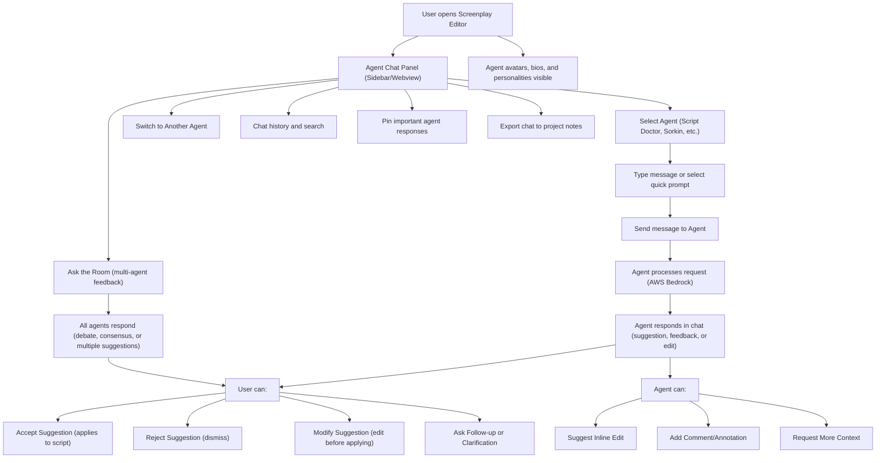

# Writers Room Agent Chat Wireframe

This document provides a detailed wireframe flowchart for the agent chat experience in Writers Room, showing the flow for user-agent interaction, agent suggestions, multi-agent feedback, and chat management. Use this as a reference for UI/UX and backend development.

---

---

**For Developer:**
- Use this wireframe to guide the agent chat UI/UX and backend API/service design.
- Each node can be mapped to a user story, UI component, or backend service endpoint.
- Update this document as flows evolve or new features are added. 