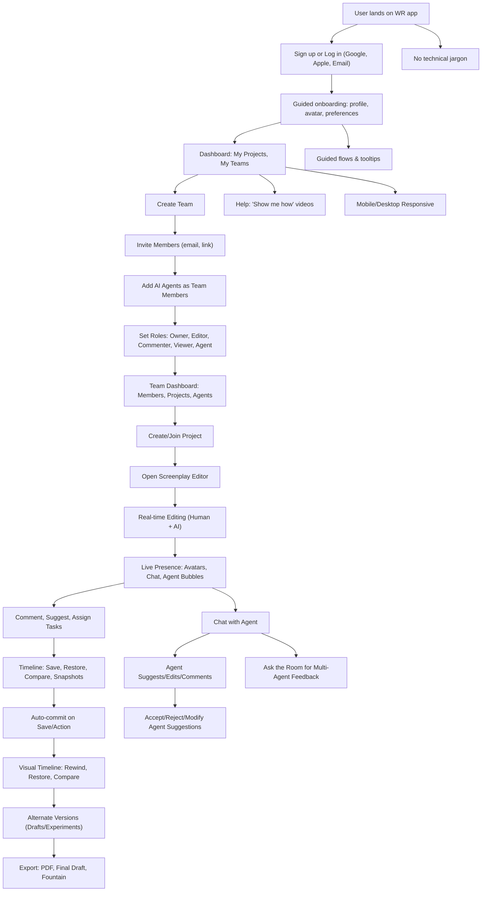

# Writers Room User/Team/Collaboration Wireframe

This document provides a high-level wireframe flowchart for the Writers Room experience, showing the seamless flow for user onboarding, team creation, project collaboration, version control, and agent interaction. This is intended as a reference for UI/UX and backend development.

---

---

**For Developer:**
- Use this wireframe to guide both UI/UX and backend API/service design.
- Each node can be mapped to a user story, UI component, or backend service endpoint.
- Update this document as flows evolve or new features are added. 